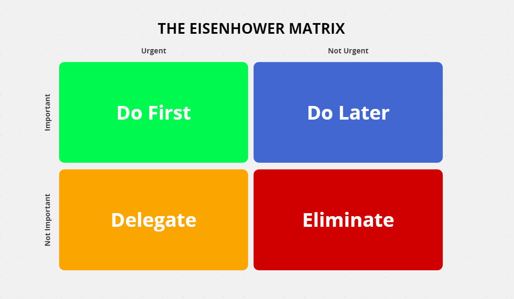
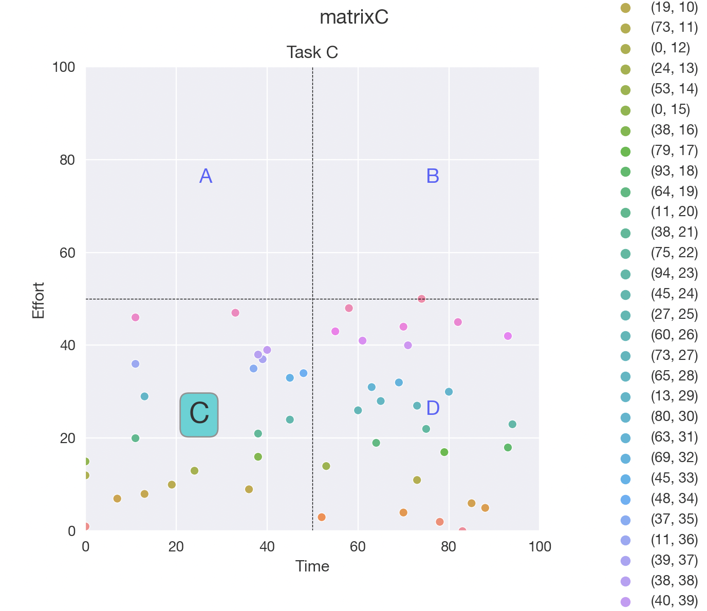

# Priority-Matrix
The priority matrix is an attempt to classify group tasks based on the Eisenhower Matrix, which helps a team decide on and priotising project tasks, goals, objectives and even questions which may need answering.

Our version of this basic prototype enables a generalisable template for all users to set a problem statement, positive/negative metrics and threshold for classifying for purposes of 'preferential signalling'.

Users can set their own variables, classes and aggregate data from its group to facilitate group decision-making. 

An example of a Matrix generated through the code:

<!-- 
DB models created with SQLAlchemy
DB is Postgres
Database configuration with alembic -->